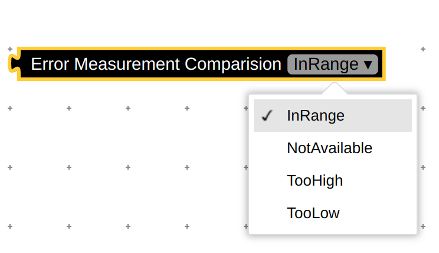

# Enumeration blocks

Using _AddEnum&lt;T>(blocklyType, displayName)_ a blockly definition is created which describes the enumeration indicated by the model type parameter _T_ which is contraint to be some _Enum_.

The corresponding implementation type will be _EnumBlock&lt;T>_ where the evaluation will just use the string field _VALUE_ and convert it to the target type using _Enum.Parse(typeof(T), ...)_. The field will be provided as a blockly _field_dropdown_.

```csharp
[JsonConverter(typeof(JsonStringEnumConverter))]
public enum ErrorComparisionResult
{
    NotAvailable = 0,
    InRange = 1,
    TooLow = 2,
    TooHigh = 3,
}
```

```csharp
builder.AddEnum<ErrorComparisionResult>("error_measurement_comparison", "Error Measurement Comparision");
```


