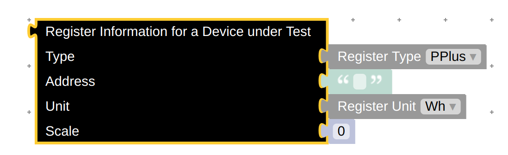

# Model blocks

A blocky definition for a model block is created using _AddModel&lt;T>(blocklyType, displayName)_. The type parameter _T_ is constraint to be a _class_ and having a parameterless constructor. The block implementation is based on _ModelBlock&lt;T>_ and the evaluation method will start with using the parameterless constructor to create a new empty instance of a model. Then all supported properties of the model will be calculated using the corresponding blockly value and stored in the new instance - including some basic conversions to adjust to the required C# type if possible. This instance is then the result of the evaluation of the model block.

For each supported property the blocky definition will get a corresponding value. A property is supported if the data type conforms to one of the following rules:

1. some enumeration
2. _bool_, _bool?_, _double_, _double?_, _long_, _long?_, _int_, _int?_ or _string_
3. another model block
4. _Dictionary&lt;TKey, TValue>_ - the _TKey_ key type must be an enumeration and _TValue_ a supported type
5. _List&lt;T>_ where _T_ is a supported type - but not a _List_ itself

Properties attributed with the _System.Text.Json.Serialization.JsonIgnoreAttribute_ or which are read only or write only are not included in the block definition.

The block definition will include a _check_ on each property made available as a value. For _List_ _check_ will contain two checks: one the untyped blockly _Array_ and a special type _Array(type)_ where _type_ is the blockly type name of each array element. This can be used in the frontend to provide a more sophisticated choice of allowed values for a property.

If the property type is supported by one of the two first rules a corresponding shadow block is added to the toolbox entry.

```csharp
public class DutRegisterInfo
{
    public DutRegisterTypes Type { get; set; }
    public string Address { get; set; } = null!;
    public DutRegisterUnits Unit { get; set; }
    public double Scale { get; set; }
}
```

```csharp
builder.AddModel<DutRegisterInfo>("dut_register_info", "Register Information for a Device under Test");
```


